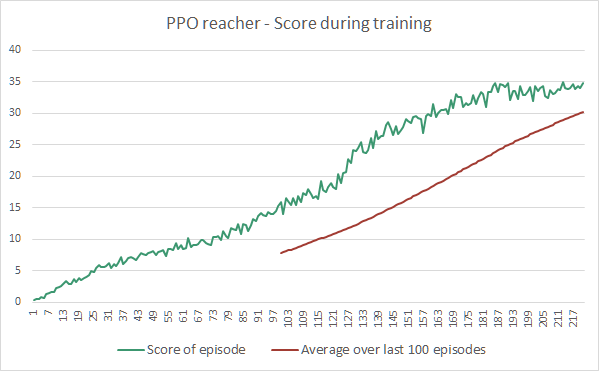

# Project Report

### Learning Algorithm

The **PPO algorithm** was used to solve this project.
It is an on-policy algorithm, from the family of policy gradient methods, that is able to tackle complex environments, continuous action spaces and distributed training.

One of the key element characterizing the PPO algorithm is the surrogate clipped objective. \
To train the neural net, we compare the probabilities of taking a given action according to a previous policy, versus the probabilities of taking that same action with the actual policy by dividing them together. \
Then, we clip the ratio of probabilities within a range close to one (e.g. [0.8 to 1,2]), and we multiply it by the advantages of doing that action in that state space, thus obtaining the clipped objective (The advantages are the delta of rewards by taking a given action instead of the average action). \
Clipping the ratio decreases the steps while updating the policy, and makes it more stable. \
That clipped objective (clipped ratio * advantages) is then compared to the unclipped objective (ratio * advantages), and the smallest objective value is the one used. The reason behind that choice is to stay more conservative with the policy updates.

Since the goal is to maximize the expected returns, and that a loss function tries to minimize a value, we use the negative value of the objective during training.
Entropy is also included has a regulization term in the loss function, thereby increasing the stochasticity of the policy, helping with exploration, and potentially helpinh with faster convergence to a good policy.

##### Hypermarameters :
|Hyperparameter|Value|
|--------------|-----|
|episode | 2000 |
|discount_rate | .99 |
|gae_lambda | 0.95 |
|surrogate_clip | 0.2 |
|surrogate_clip_decay | 1 |
|beta | 1e-2 |
|beta_decay | 1 |
|SGD_epoch | 4 |
|LR | 1e-4 |
|adam_epsilon | 3e-4 |
|batch_size | 500 |
|hidden_size | 128 |
|gradient_clip | 5 |
|rollout_size | 500 |

##### Actor neural network structure :

| Layer | type | Input size | Output size | Activation |
|-------|------|------------|-------------|------------|
|1 | Fully Connected | 33 (state size) | 1024 | ReLU |
|2  | Fully Connected | 128 | 128 | ReLU |
|3 | Fully Connected | 128 | 128 | ReLU |
|4  | Fully Connected | 128 | 4 (action size) | tanh |

##### Value neural network structure :

| Layer | type | Input size | Output size | Activation |
|-------|------|------------|-------------|------------|
|1 | Fully Connected | 33 (state size) | 1024 | ReLU |
|2  | Fully Connected | 128 | 128 | ReLU |
|3  | Fully Connected | 128 | 128 | ReLU |
|4 | Fully Connected | 1024 | 1 | None |

### Plot of rewards

In **121** episodes, the game was solved by achieving an average score of at least +30 over the next 100 episodes.



```
Episode  217  avg score:  34.563499227445575
Episode  218  avg score:  33.79699924457818
Episode  219  avg score:  34.288499233592304
Episode  220  avg score:  34.00399923995137
Episode  221  avg score:  34.84549922114238

Environment solved in 121 episodes!     Average Score: 30.166
```


### Ideas for future work

